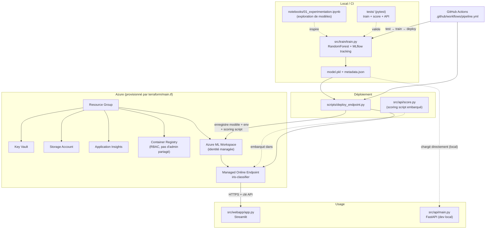

# ml-iris-classifier

Pipeline ML de bout en bout : entraînement d'un classifieur Iris, déploiement
sur **Azure Machine Learning** via Terraform + GitHub Actions, et une
interface web **Streamlit** pour l'utiliser concrètement une fois hébergé.

## Architecture



### Le flux, étape par étape

1. **Expérimentation** — [`notebooks/01_experimentation.ipynb`](notebooks/01_experimentation.ipynb)
   compare plusieurs modèles (RandomForest, GradientBoosting, SVM, régression
   logistique) avec MLflow pour choisir l'approche retenue en production
   (RandomForest).

2. **Entraînement** — [`src/train/train.py`](src/train/train.py) charge le
   dataset Iris de scikit-learn, entraîne un `RandomForestClassifier`, logue
   paramètres/métriques dans MLflow (`with mlflow.start_run(): ...`), et
   sauvegarde `model.pkl` + `metadata.json` dans `src/train/outputs/`.

3. **Infrastructure Azure** — [`terraform/main.tf`](terraform/main.tf)
   provisionne tout ce dont Azure ML a besoin :
   - un **Resource Group** ;
   - un **Storage Account** (stockage des données/artéfacts du workspace) ;
   - une **Key Vault** (secrets du workspace) avec une politique d'accès
     dédiée à l'identité managée du workspace (en plus de celle de
     l'utilisateur qui déploie) ;
   - **Application Insights** (monitoring) ;
   - un **Container Registry** utilisé en **RBAC** (`AcrPull` accordé à
     l'identité managée du workspace) plutôt qu'avec des identifiants admin
     partagés ;
   - un **Azure ML Workspace** (identité `SystemAssigned`), lié au Storage,
     à la Key Vault, à Application Insights et à l'ACR ci-dessus.

4. **Déploiement du modèle** — [`scripts/deploy_endpoint.py`](scripts/deploy_endpoint.py)
   utilise le SDK `azure-ai-ml` pour :
   - copier `model.pkl` à côté du script de scoring (`src/api/model.pkl`) ;
   - créer l'environnement conda (`src/train/conda.yml`) ;
   - enregistrer le modèle dans le workspace ;
   - créer/mettre à jour un **Managed Online Endpoint** (`iris-classifier`) ;
   - créer un déploiement qui embarque
     [`src/api/score.py`](src/api/score.py) comme scoring script — c'est ce
     fichier (`init()` / `run()`) qui s'exécute réellement dans le
     conteneur Azure ML à chaque appel du endpoint.

5. **Utilisation réelle** — une fois le endpoint déployé, il expose une URL
   HTTPS + clé d'API. C'est ce que consomme l'interface
   [`src/webapp/app.py`](src/webapp/app.py) (Streamlit) : l'utilisateur
   saisit les 4 caractéristiques d'une fleur, l'app appelle le endpoint Azure
   et affiche la classe prédite + les probabilités.

6. **CI/CD** — [`.github/workflows/pipeline.yml`](.github/workflows/pipeline.yml)
   enchaîne trois jobs à chaque push sur `src/**` : `test` (pytest) →
   `train` (génère et publie `model.pkl`/`metadata.json` en artefact) →
   `deploy` (télécharge l'artefact et lance `deploy_endpoint.py` avec les
   credentials Azure stockés en secrets GitHub).

### Un chemin secondaire : l'API locale

[`src/api/main.py`](src/api/main.py) (FastAPI) est un serveur de dev qui
charge `model.pkl` **directement depuis le disque** (`src/train/outputs/`) —
utile pour tester rapidement en local sans passer par Azure. Il duplique une
partie de la logique de `score.py` volontairement : les deux servent des
contextes différents (dev local vs scoring script exécuté par Azure ML) et
n'ont pas le même contrat de réponse.

## Structure du projet

```
├── notebooks/               Exploration de modèles (MLflow)
├── src/
│   ├── train/                train.py, requirements, conda.yml → model.pkl
│   ├── api/                   main.py (FastAPI dev) + score.py (scoring Azure ML)
│   └── webapp/                app.py (Streamlit) → consomme le endpoint Azure
├── scripts/
│   └── deploy_endpoint.py    Enregistre modèle/env/endpoint sur Azure ML
├── terraform/
│   └── main.tf                Infra Azure (RG, Storage, KV, ACR, ML Workspace)
├── tests/                     pytest : entraînement, scoring, API
└── .github/workflows/
    └── pipeline.yml           CI/CD : test → train → deploy
```

## Démarrage local

```bash
python3.10 -m venv .venv
source .venv/bin/activate
pip install -r requirements-dev.txt
```

> Le projet est pinné sur des dépendances compatibles **Python 3.10**
> (scikit-learn 1.3.2 n'a pas de wheel pour des versions plus récentes de
> Python sans compilation).

### Entraîner le modèle

```bash
cd src/train && python train.py
```

Génère `src/train/outputs/model.pkl` et `metadata.json`.

### Lancer les tests

```bash
pytest -v
```

Couvre : génération du modèle et des métadonnées par `train.py`, seuil de
performance minimal, `score.py` (`init`/`run`, y compris payload invalide),
et l'API FastAPI (`/health`, `/info`, `/predict`, `/predict-batch`).

### Lancer l'API locale (FastAPI)

```bash
cd src/api && uvicorn main:app --reload
```

→ `http://localhost:8000/docs`

### Lancer l'interface web (Streamlit)

```bash
streamlit run src/webapp/app.py
```

Renseigne `AZURE_ML_ENDPOINT_URL` et `AZURE_ML_ENDPOINT_KEY` (variables
d'environnement, fichier `.env`, ou directement dans la barre latérale de
l'app) — récupérables avec :

```bash
az ml online-endpoint show -n iris-classifier --query scoring_uri
az ml online-endpoint get-credentials -n iris-classifier --query primaryKey
```

## Infrastructure (Terraform)

```bash
cd terraform
terraform init
terraform plan
terraform apply
```

Variables disponibles : `project_name` (défaut `ml-demo`), `environment`
(défaut `dev`), `location` (défaut `eastus`).

## Variables d'environnement / secrets

| Variable | Utilisée par | Description |
|---|---|---|
| `AZURE_SUBSCRIPTION_ID` | `deploy_endpoint.py`, CI | ID de l'abonnement Azure |
| `AZURE_ML_WORKSPACE_NAME` | `deploy_endpoint.py`, CI | Nom du workspace ML (`mlws-<project_name>`) |
| `AZURE_ML_RESOURCE_GROUP` | `deploy_endpoint.py`, CI | Resource group (`rg-<project_name>-<environment>`) |
| `AZURE_TENANT_ID`, `AZURE_CLIENT_ID`, `AZURE_CLIENT_SECRET` | CI (`DefaultAzureCredential`) | Service principal utilisé par `deploy_endpoint.py` en pipeline |
| `AZURE_ML_ENDPOINT_URL`, `AZURE_ML_ENDPOINT_KEY` | `src/webapp/app.py` | URL et clé du Managed Online Endpoint |

En CI, `AZURE_SUBSCRIPTION_ID/TENANT_ID/CLIENT_ID/CLIENT_SECRET` sont des
secrets GitHub Actions (`Settings → Secrets and variables → Actions`).

## Limites connues

- **State Terraform en local uniquement** (`terraform.tfstate` non versionné,
  pas de backend distant) — pas de verrouillage ni de collaboration multi-
  personnes. À faire évoluer vers un backend `azurerm` distant si le projet
  passe à plusieurs contributeurs.
- **`public_network_access_enabled = true`** sur le workspace ML — acceptable
  pour un environnement de démo/dev, à durcir (réseau privé / private
  endpoints) avant tout usage en production.
- Pas de tests d'intégration contre un vrai endpoint Azure déployé (les tests
  actuels couvrent l'entraînement, le scoring local et l'API FastAPI locale,
  pas un appel réseau réel au Managed Online Endpoint).
