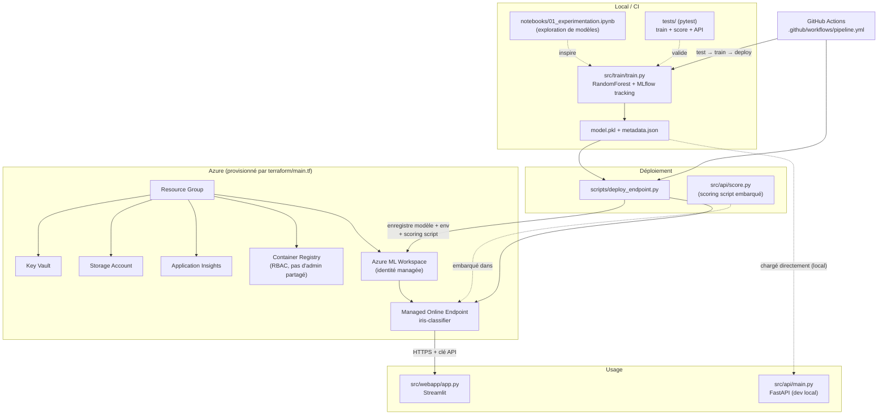

# ml-iris-classifier

Pipeline ML de bout en bout : entraînement d'un classifieur Iris, déploiement
sur **Azure Machine Learning** via Terraform + GitHub Actions, et une
interface web **Streamlit** pour l'utiliser concrètement une fois hébergé.

## Architecture



### Le flux, étape par étape

1. **Expérimentation** — [`notebooks/01_experimentation.ipynb`](notebooks/01_experimentation.ipynb)
   compare plusieurs modèles (RandomForest, GradientBoosting, SVM, régression
   logistique) avec MLflow pour choisir l'approche retenue en production
   (RandomForest).

2. **Entraînement** — [`src/train/train.py`](src/train/train.py) charge le
   dataset Iris de scikit-learn, entraîne un `RandomForestClassifier`, logue
   paramètres/métriques dans MLflow (`with mlflow.start_run(): ...`), et
   sauvegarde `model.pkl` + `metadata.json` dans `src/train/outputs/`.

3. **Infrastructure Azure** — [`terraform/main.tf`](terraform/main.tf)
   provisionne tout ce dont Azure ML a besoin :
   - un **Resource Group** ;
   - un **Storage Account** (stockage des données/artéfacts du workspace) ;
   - une **Key Vault** (secrets du workspace) avec une politique d'accès
     dédiée à l'identité managée du workspace (en plus de celle de
     l'utilisateur qui déploie) ;
   - **Application Insights** (monitoring) ;
   - un **Container Registry** utilisé en **RBAC** (`AcrPull` accordé à
     l'identité managée du workspace) plutôt qu'avec des identifiants admin
     partagés ;
   - un **Azure ML Workspace** (identité `SystemAssigned`), lié au Storage,
     à la Key Vault, à Application Insights et à l'ACR ci-dessus.

4. **Déploiement du modèle** — [`scripts/deploy_endpoint.py`](scripts/deploy_endpoint.py)
   utilise le SDK `azure-ai-ml` pour :
   - copier `model.pkl` à côté du script de scoring (`src/api/model.pkl`) ;
   - créer l'environnement conda (`src/train/conda.yml`) ;
   - enregistrer le modèle dans le workspace ;
   - créer/mettre à jour un **Managed Online Endpoint** (`iris-classifier`) ;
   - créer un déploiement qui embarque
     [`src/api/score.py`](src/api/score.py) comme scoring script — c'est ce
     fichier (`init()` / `run()`) qui s'exécute réellement dans le
     conteneur Azure ML à chaque appel du endpoint.

5. **Utilisation réelle** — une fois le endpoint déployé, il expose une URL
   HTTPS + clé d'API. C'est ce que consomme l'interface
   [`src/webapp/app.py`](src/webapp/app.py) (Streamlit) : l'utilisateur
   saisit les 4 caractéristiques d'une fleur, l'app appelle le endpoint Azure
   et affiche la classe prédite + les probabilités.

6. **CI/CD** — [`.github/workflows/pipeline.yml`](.github/workflows/pipeline.yml)
   enchaîne trois jobs à chaque push sur `src/**` : `test` (pytest) →
   `train` (génère et publie `model.pkl`/`metadata.json` en artefact) →
   `deploy` (télécharge l'artefact et lance `deploy_endpoint.py` avec les
   credentials Azure stockés en secrets GitHub).

### Un chemin secondaire : l'API locale

[`src/api/main.py`](src/api/main.py) (FastAPI) est un serveur de dev qui
charge `model.pkl` **directement depuis le disque** (`src/train/outputs/`) —
utile pour tester rapidement en local sans passer par Azure. Il duplique une
partie de la logique de `score.py` volontairement : les deux servent des
contextes différents (dev local vs scoring script exécuté par Azure ML) et
n'ont pas le même contrat de réponse.

## Structure du projet — rôle de chaque dossier et fichier

Vue d'ensemble rapide, détail juste après :

```
├── notebooks/               Exploration de modèles (MLflow)
├── src/
│   ├── train/                train.py, requirements, conda.yml → model.pkl
│   ├── api/                   main.py (FastAPI dev) + score.py (scoring Azure ML)
│   └── webapp/                app.py (Streamlit) → consomme le endpoint Azure
├── scripts/
│   └── deploy_endpoint.py    Enregistre modèle/env/endpoint sur Azure ML
├── terraform/
│   └── main.tf                Infra Azure (RG, Storage, KV, ACR, ML Workspace)
├── tests/                     pytest : entraînement, scoring, API
├── .github/workflows/
│   └── pipeline.yml           CI/CD : test → train → deploy
├── requirements-dev.txt       Deps de dev (train + api + pytest, une seule commande)
├── pytest.ini                 Config pytest (pythonpath vers src/train et src/api)
└── .env                        Secrets locaux (jamais commité)
```

Chaque dossier ci-dessous correspond à une **étape distincte** du cycle de vie
d'un projet ML. C'est volontairement séparé ainsi : chaque étape a un cycle
de vie, des dépendances et un public différents (un data scientist explore,
une CI entraîne, Azure sert, un utilisateur clique).

### `notebooks/` — Exploration, avant tout code de production

- **`01_experimentation.ipynb`** — le seul endroit où on compare plusieurs
  approches (ici RandomForest / GradientBoosting / SVM / régression
  logistique) avec MLflow pour choisir un modèle. Rien de ce dossier n'est
  importé ailleurs dans le projet : c'est un journal de décision, pas du
  code réutilisé. Une fois le choix fait (RandomForest), la logique retenue
  est **réécrite proprement** dans `src/train/train.py` — jamais le notebook
  lui-même qui n'est pas déployable ni testable.
- **`mlflow.db`** — base SQLite locale où le notebook logue ses runs
  (gitignored : c'est un artefact d'exécution locale, pas du code).

*Leçon à réutiliser* : un notebook sert à décider, pas à livrer. Le code qui
part en production doit être un `.py` testable.

### `src/train/` — Entraînement : la seule source de vérité du modèle

- **`train.py`** — charge les données, entraîne, évalue, logue dans MLflow,
  sauvegarde `model.pkl` + `metadata.json`. Point clé : la fonction
  `train(output_dir)` est **découplée** de `main()` (qui gère juste le run
  MLflow et l'affichage) — c'est ce qui permet aux tests de l'appeler
  directement, avec un `output_dir` de leur choix.
- **`requirements.txt`** — dépendances **strictement nécessaires pour
  entraîner** (scikit-learn, mlflow, pandas...). Ne contient jamais de
  dépendances de serving (FastAPI, Streamlit) : l'environnement
  d'entraînement n'est pas l'environnement de serving.
- **`conda.yml`** — les mêmes dépendances, au format conda. C'est ce
  fichier (pas `requirements.txt`) que Azure ML utilise pour construire
  l'image du conteneur qui exécute `score.py` en production.
- **`outputs/`** (généré, gitignored) — `model.pkl` + `metadata.json`,
  jamais commités : ce sont des artefacts binaires reproductibles à partir
  du code, pas du code lui-même. Ils transitent par les artefacts GitHub
  Actions (`actions/upload-artifact`) entre le job `train` et le job
  `deploy`.

*Leçon à réutiliser* : séparer "ce qui entraîne" de "ce qui sert", même en
tant que dépendances — c'est ce qui a évité un `requirements.txt` d'API
gonflé de dépendances de training inutiles (bug corrigé dans ce projet).

### `src/api/` — Deux façons de servir le même modèle, deux contrats différents

- **`score.py`** — le **contrat imposé par Azure ML Managed Online
  Endpoint** : une fonction `init()` (charge le modèle une fois au
  démarrage du conteneur) et `run(data)` (appelée à chaque requête). C'est
  ce fichier, et uniquement lui, qui tourne réellement dans Azure une fois
  déployé.
- **`main.py`** — un serveur FastAPI de **développement local**, qui
  charge `model.pkl` directement depuis `src/train/outputs/`. Pratique pour
  itérer vite sans passer par Azure, avec un contrat de réponse plus riche
  (nom de classe, dict de probabilités) que `score.py` (index brut).
- **`requirements.txt`** — dépendances de serving (fastapi, uvicorn,
  pydantic) : encore une fois, pas les dépendances de training.
- **`model.pkl`** (généré, gitignored) — copié ici par
  `deploy_endpoint.py` juste avant déploiement, pour que `score.py` et
  `model.pkl` partent ensemble dans le même `code_configuration` Azure ML.

*Leçon à réutiliser* : le "scoring script" imposé par une plateforme
managée (Azure ML, SageMaker, Vertex AI...) a presque toujours un contrat
d'interface rigide (`init`/`run` ici) — ne pas essayer d'y faire porter
aussi les besoins de dev local ou d'un contrat API plus riche : séparer.

### `src/webapp/` — L'interface qui rend le modèle réellement utilisable

- **`app.py`** — Streamlit. Ne contient **aucune logique ML** : il
  collecte les 4 features via l'UI, appelle l'URL HTTPS du endpoint Azure
  avec la clé d'API, affiche la réponse. C'est un client HTTP comme un
  autre, découplé du reste — il pourrait tout aussi bien appeler
  n'importe quel modèle exposé en REST.
- **`requirements.txt`** — streamlit, requests, python-dotenv : rien
  d'autre (ni scikit-learn, ni mlflow — ce dossier n'a jamais besoin de
  charger un modèle localement).

*Leçon à réutiliser* : l'interface finale consomme le modèle **via son API
de production**, jamais en chargeant le `.pkl` en local — sinon on teste
un chemin différent de celui utilisé par les vrais utilisateurs.

### `scripts/` — Automatisation ponctuelle, hors du cycle entraînement/serving

- **`deploy_endpoint.py`** — orchestre le SDK `azure-ai-ml` : enregistre
  l'environnement conda, enregistre le modèle, crée/actualise le endpoint
  et son déploiement. C'est le pont entre "j'ai un `model.pkl` local" et
  "il existe une URL Azure qui répond".

*Leçon à réutiliser* : garder ce genre de script d'orchestration séparé du
code applicatif (`src/`) — c'est un script d'exploitation, appelé par la CI
ou manuellement, pas importé par autre chose.

### `terraform/` — L'infrastructure comme du code versionné

- **`main.tf`** — tout ce que Azure ML a besoin pour exister : Resource
  Group, Storage Account, Key Vault (+ politiques d'accès), Application
  Insights, Container Registry (RBAC), Workspace ML (identité managée),
  avec les `output` nécessaires (nom du workspace, URL de l'ACR...) pour
  que `deploy_endpoint.py`/la CI sachent où déployer.
- **`.terraform.lock.hcl`** — versions exactes des providers, pour des
  `apply` reproductibles d'une machine à l'autre (à committer, contrairement
  à `.terraform/`).
- **`.terraform/`, `terraform.tfstate*`** (gitignored) — cache local des
  providers et **état réel de l'infrastructure**. Le state n'est pas du
  code : il contient parfois des données sensibles et doit en théorie vivre
  dans un backend distant partagé (limite connue de ce projet, voir plus
  bas).

*Leçon à réutiliser* : toute ressource cloud créée "à la main" une fois est
une ressource qu'on ne saura plus reproduire à la prochaine mission —
Terraform (ou équivalent) dès le premier provisioning, même pour un projet
de démo.

### `tests/` — Le filet de sécurité qui rend les changements sûrs

- **`conftest.py`** — fixtures partagées : `trained_model` entraîne un
  vrai modèle une fois par session de tests, **exactement là où** l'app et
  le scoring script l'attendent (pas de mock du modèle : on teste le vrai
  pipeline train → serve).
- **`test_train.py`** — le training produit bien les fichiers attendus,
  les métadonnées ont la bonne forme, la performance dépasse un seuil
  minimal.
- **`test_score.py`** — le contrat Azure ML (`init`/`run`) fonctionne,
  y compris sur un payload invalide (doit renvoyer une erreur structurée,
  pas planter).
- **`test_api.py`** — chaque route FastAPI répond correctement. C'est ce
  test qui a détecté que `/predict-batch` avait disparu du code (régression
  silencieuse d'un précédent commit) — la preuve concrète de l'utilité de
  cette couche.

*Leçon à réutiliser* : tester avec un **vrai modèle entraîné pendant le
test**, pas un mock — un mock aurait laissé passer le bug `/predict-batch`
et ne dit rien sur la validité réelle du pipeline.

### `.github/workflows/` — CI/CD : automatiser le chemin du code à Azure

- **`pipeline.yml`** — trois jobs enchaînés à chaque push sur `src/**` :
  `test` (pytest, bloque la suite si rouge) → `train` (génère et publie
  `model.pkl`/`metadata.json` en artefact GitHub) → `deploy` (télécharge
  l'artefact, lance `deploy_endpoint.py` avec des secrets Azure). Chaque job
  tourne dans un environnement propre et ne réutilise que ce que le job
  précédent lui a explicitement transmis (artefact), jamais un état de
  filesystem implicite.

*Leçon à réutiliser* : la CI doit reproduire *exactement* les commandes
qu'un humain lancerait en local (`pytest`, `python train.py`,
`python deploy_endpoint.py`) — pas une logique parallèle qui diverge avec le
temps.

### Fichiers à la racine

| Fichier | Rôle |
|---|---|
| `requirements-dev.txt` | Une seule commande pour tout installer en dev (`-r src/train/requirements.txt -r src/api/requirements.txt` + pytest/httpx) |
| `pytest.ini` | Déclare `src/train` et `src/api` sur le `pythonpath` pour que les tests importent `train`, `main`, `score` sans installer le projet en package |
| `.gitignore` | Exclut artefacts générés (`outputs/`, `*.pkl`, `mlruns/`), state Terraform, `.env`, venv |
| `.env` | Secrets locaux (jamais commité — voir section variables d'environnement) |
| `README.md` | Ce fichier |

## Démarrage local

```bash
python3.10 -m venv .venv
source .venv/bin/activate
pip install -r requirements-dev.txt
```

> Le projet est pinné sur des dépendances compatibles **Python 3.10**
> (scikit-learn 1.3.2 n'a pas de wheel pour des versions plus récentes de
> Python sans compilation).

### Entraîner le modèle

```bash
cd src/train && python train.py
```

Génère `src/train/outputs/model.pkl` et `metadata.json`.

### Lancer les tests

```bash
pytest -v
```

Couvre : génération du modèle et des métadonnées par `train.py`, seuil de
performance minimal, `score.py` (`init`/`run`, y compris payload invalide),
et l'API FastAPI (`/health`, `/info`, `/predict`, `/predict-batch`).

### Lancer l'API locale (FastAPI)

```bash
cd src/api && uvicorn main:app --reload
```

→ `http://localhost:8000/docs`

### Lancer l'interface web (Streamlit)

```bash
streamlit run src/webapp/app.py
```

Renseigne `AZURE_ML_ENDPOINT_URL` et `AZURE_ML_ENDPOINT_KEY` (variables
d'environnement, fichier `.env`, ou directement dans la barre latérale de
l'app) — récupérables avec :

```bash
az ml online-endpoint show -n iris-classifier --query scoring_uri
az ml online-endpoint get-credentials -n iris-classifier --query primaryKey
```

## Infrastructure (Terraform)

```bash
cd terraform
terraform init
terraform plan
terraform apply
```

Variables disponibles : `project_name` (défaut `ml-demo`), `environment`
(défaut `dev`), `location` (défaut `eastus`).

## Variables d'environnement / secrets

| Variable | Utilisée par | Description |
|---|---|---|
| `AZURE_SUBSCRIPTION_ID` | `deploy_endpoint.py`, CI | ID de l'abonnement Azure |
| `AZURE_ML_WORKSPACE_NAME` | `deploy_endpoint.py`, CI | Nom du workspace ML (`mlws-<project_name>`) |
| `AZURE_ML_RESOURCE_GROUP` | `deploy_endpoint.py`, CI | Resource group (`rg-<project_name>-<environment>`) |
| `AZURE_TENANT_ID`, `AZURE_CLIENT_ID`, `AZURE_CLIENT_SECRET` | CI (`DefaultAzureCredential`) | Service principal utilisé par `deploy_endpoint.py` en pipeline |
| `AZURE_ML_ENDPOINT_URL`, `AZURE_ML_ENDPOINT_KEY` | `src/webapp/app.py` | URL et clé du Managed Online Endpoint |

En CI, `AZURE_SUBSCRIPTION_ID/TENANT_ID/CLIENT_ID/CLIENT_SECRET` sont des
secrets GitHub Actions (`Settings → Secrets and variables → Actions`).

## Grille de reproductibilité pour un prochain projet ML

Le pattern générique derrière ce projet, indépendant d'Iris/Azure/Streamlit —
à recréer dès le premier jour d'un prochain projet, dans cet ordre :

| # | Besoin générique | Ce qu'on met en place | Exemple ici |
|---|---|---|---|
| 1 | Explorer sans polluer le code de prod | Un notebook + tracking d'expériences (MLflow ou équivalent), jamais importé ailleurs | `notebooks/01_experimentation.ipynb` |
| 2 | Un entraînement reproductible et testable | Une fonction `train(output_dir) -> metadata`, séparée du `main()`/CLI, avec run de tracking protégé (`with ...:`) | `src/train/train.py` |
| 3 | Séparer les dépendances par étape | Un `requirements.txt` (ou équivalent) **par dossier**, jamais un seul fichier partagé entre training/serving/UI | `src/train/`, `src/api/`, `src/webapp/` |
| 4 | Un contrat de serving conforme à la plateforme cible | Respecter le contrat imposé (`init`/`run`, handler Lambda, etc.) dans un fichier dédié, sans y mélanger les besoins de dev local | `src/api/score.py` vs `src/api/main.py` |
| 5 | Un filet de tests avant tout changement | Tests qui entraînent/chargent un **vrai** modèle (pas de mock du cœur du pipeline), sur les 3 couches : training, scoring, API | `tests/` |
| 6 | Une infra reproductible, pas cliquée à la main | Infra as Code dès la première ressource cloud (Terraform/Bicep/Pulumi), avec RBAC plutôt que credentials partagés | `terraform/main.tf` |
| 7 | Un pipeline qui fait ce qu'un humain ferait | CI/CD qui enchaîne test → train → deploy avec les mêmes commandes qu'en local, gated sur les tests | `.github/workflows/pipeline.yml` |
| 8 | Un moyen réel d'utiliser le résultat | Un client (webapp, CLI, bot...) qui appelle l'**API de production**, jamais le modèle chargé en local | `src/webapp/app.py` |
| 9 | Une doc qui explique le *pourquoi*, pas juste le *quoi* | Un README avec diagramme d'architecture + rôle de chaque dossier + limites connues assumées | ce fichier |

Point de départ concret pour la prochaine mission : copier la structure de
dossiers (`notebooks/`, `src/<étape>/`, `scripts/`, `<iac>/`, `tests/`,
`.github/workflows/`), écrire le tableau ci-dessus avec les technologies
réelles du nouveau projet, puis avancer étape par étape dans l'ordre —
chaque étape doit être testée/validée avant de construire la suivante.

## Limites connues

- **State Terraform en local uniquement** (`terraform.tfstate` non versionné,
  pas de backend distant) — pas de verrouillage ni de collaboration multi-
  personnes. À faire évoluer vers un backend `azurerm` distant si le projet
  passe à plusieurs contributeurs.
- **`public_network_access_enabled = true`** sur le workspace ML — acceptable
  pour un environnement de démo/dev, à durcir (réseau privé / private
  endpoints) avant tout usage en production.
- Pas de tests d'intégration contre un vrai endpoint Azure déployé (les tests
  actuels couvrent l'entraînement, le scoring local et l'API FastAPI locale,
  pas un appel réseau réel au Managed Online Endpoint).
